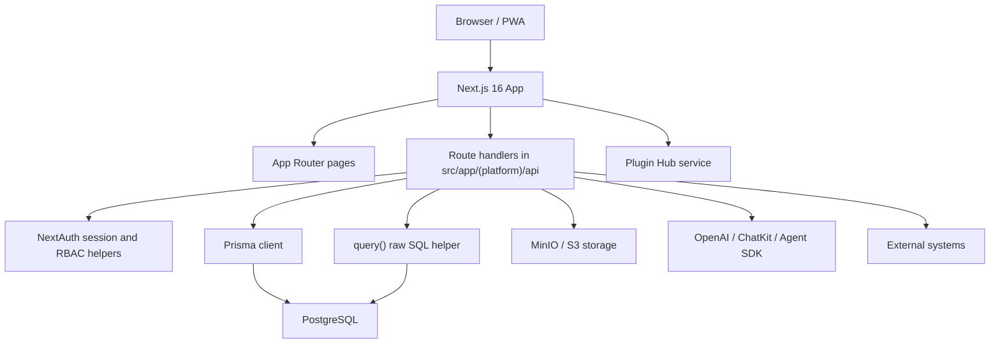

# High-Level Architecture

## Purpose

This repository contains a Unified Data Platform for technical operators and developers. It combines master-data management, dynamic data modeling, multi-tenant spaces, storage, project management, AI/chatbot tooling, reporting, and a plugin ecosystem in one Next.js application.

The product is configuration-first: users should be able to understand and adjust platform behavior quickly without moving through a heavy enterprise console.

## Current Stack

- **Framework:** Next.js 16 App Router, React 19, TypeScript 5
- **Database:** PostgreSQL through Prisma 6 and selected raw SQL helpers
- **Auth:** NextAuth.js 4 with credentials, Google OAuth, Azure AD, 2FA, account lockout, and dynamic SSO config
- **Storage:** MinIO and S3-compatible providers
- **AI:** OpenAI API, ChatKit, OpenAI Agent SDK, Dify integration
- **UI:** Tailwind CSS 4, local Shadcn/Radix-style primitives, Lucide React
- **Server state:** TanStack React Query where feature code has adopted it
- **Observability:** SigNoz and Langfuse hooks, intended to fail silently when not configured
- **Plugin ecosystem:** `plugin-hub/` is a separate app/service; main-app source imports are centralized through plugin adapters

## Source Layout

```text
src/
  app/                       Next.js App Router routes
    (platform)/              Authenticated platform pages and API routes
    [space]/                 Space-scoped runtime routes
    chat/[id]/               Public chatbot/widget runtime
  components/                Shared application components
    ui/                      Local UI primitives
    layout/                  Shared navigation/layout
  features/                  Feature packages used outside route folders
  contexts/                  React context providers
  hooks/                     Shared hooks
  lib/                       Core server/client utilities
  shared/                    Cross-feature server utilities
  types/                     Shared TypeScript contracts
plugin-hub/                  Separate plugin ecosystem app/source tree
prisma/schema.prisma         Database schema and Prisma model source of truth
docs/                        Architecture and domain documentation
scripts/                     Operational scripts
```

## Runtime Architecture



## Data Architecture

The app currently has two data modeling systems:

1. **DataModel / Attribute / DataRecord / DataRecordValue**  
   A structured dynamic model system with defined attributes.

2. **EAV System: EntityType / EavAttribute / EavEntity / EavValue**  
   A more flexible entity-attribute-value system for arbitrary schemas.

Both systems are active. New work should make an explicit choice rather than adding a third modeling path.

## API Architecture

Most active backend behavior lives in Next.js route handlers under `src/app/(platform)/api`. Prisma is the preferred ORM for schema-backed operations. Raw SQL is used where dynamic schemas, compatibility, or legacy table names require it.

When writing raw SQL with UUID comparisons, cast the column to text:

```sql
WHERE id::text = $1
```

Do not cast the parameter to UUID in raw SQL through Prisma-bound parameters.

## Plugin Boundary

`plugin-hub/` is intended to be a separate app/service. The desired boundary is:

- Main app reads plugin metadata from manifests or plugin hub APIs.
- Main app renders plugin UI through stable component registration or dynamic loading.
- Main app does not import arbitrary plugin source from route pages.

Current technical debt: the adapter layer still re-exports plugin source, so plugin internals can still affect the main build. This is cleaner than route-level imports, but the longer-term target is manifest/API/dynamic registration.

## Quality Hotspots

The codebase has several large components that should be split before adding major behavior:

- `src/components/project-management/TicketDetailModalEnhanced.tsx`
- `src/components/studio/layout-config/ChartConfigurationSection.tsx`
- `src/app/(platform)/admin/features/data/components/DatabaseDataModelMerged.tsx`
- `src/app/(platform)/admin/features/users/components/UserManagement.tsx`
- `src/app/[space]/settings/page.tsx`
- `src/app/(platform)/admin/features/storage/components/StorageManagement.tsx`

Recommended split pattern:

- `types.ts` for local contracts
- `constants.ts` for static options
- `api.ts` or `service.ts` for fetch/data access
- `useXyz.ts` for state orchestration
- `components/` for focused presentational pieces

## Refactor Rules

- Keep route handlers thin.
- Keep feature-owned logic close to the feature.
- Put shared contracts in `src/types` only when more than one feature uses them.
- Prefer Prisma for schema-backed data and `query()` for dynamic/legacy SQL.
- Avoid adding new `any` outside plugin/dynamic integration boundaries.
- Avoid adding direct `@plugins/*` imports from app routes.
- Keep UI primitives stable; if many call sites need a prop, update the primitive once.

## Verification Gates

Use these gates after architecture or refactor work:

```bash
npm run lint
npm run type-check
npm run build
```

If disk space or locked Prisma binaries block `npm run build` on Windows, run TypeScript directly without incremental cache writes:

```bash
.\node_modules\.bin\tsc.cmd --noEmit --incremental false --pretty false
```
