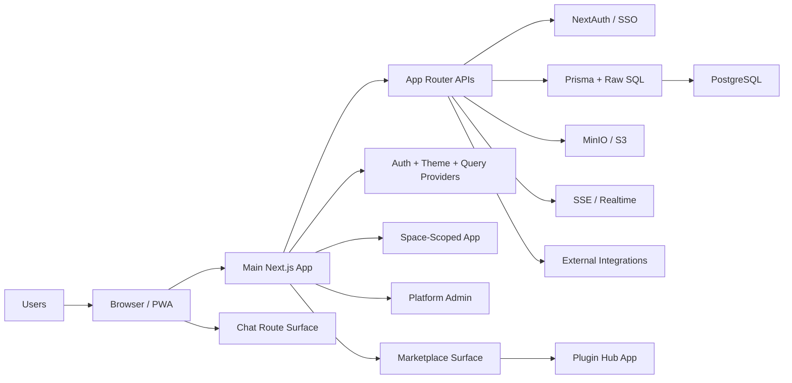

---
tags:
  - diagram
  - architecture
---

# 48 Architecture Diagram - System Context

```mermaid
flowchart LR
  User["Users"] --> Browser["Browser / PWA"]
  Browser --> App["Main Next.js App"]
  Browser --> Chat["Chat Route Surface"]
  App --> API["App Router APIs"]
  App --> Providers["Auth + Theme + Query Providers"]
  API --> Auth["NextAuth / SSO"]
  API --> Prisma["Prisma + Raw SQL"]
  API --> Storage["MinIO / S3"]
  API --> Realtime["SSE / Realtime"]
  API --> Integrations["External Integrations"]
  App --> Space["Space-Scoped App"]
  App --> Admin["Platform Admin"]
  App --> Marketplace["Marketplace Surface"]
  Marketplace --> PluginHub["Plugin Hub App"]
  Prisma --> DB["PostgreSQL"]
```

## Connected Notes

- [[17 Architecture Summary]]
- [[11 Plugin Hub]]
- [[12 Operations & Integrations]]
