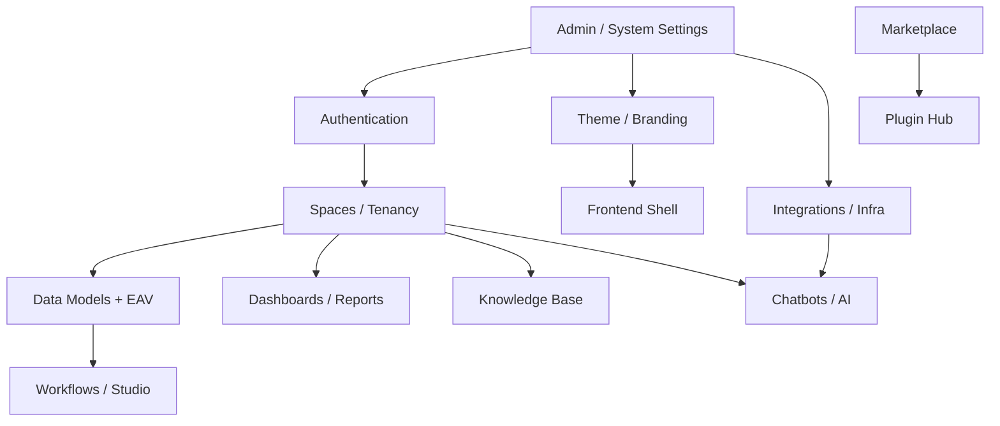

---
tags:
  - diagram
  - domains
---

# 49 Architecture Diagram - Domain Relationships

```mermaid
graph TD
  Auth["Authentication"] --> Spaces["Spaces / Tenancy"]
  Spaces --> Data["Data Models + EAV"]
  Spaces --> Dashboards["Dashboards / Reports"]
  Spaces --> Knowledge["Knowledge Base"]
  Spaces --> Chatbots["Chatbots / AI"]
  Admin["Admin / System Settings"] --> Auth
  Admin --> Theme["Theme / Branding"]
  Admin --> Integrations["Integrations / Infra"]
  Theme --> Shell["Frontend Shell"]
  Data --> Workflows["Workflows / Studio"]
  Integrations --> Chatbots
  Marketplace["Marketplace"] --> PluginHub["Plugin Hub"]
```

## Connected Notes

- [[00 Home]]
- [[39 Change Hotspots]]
